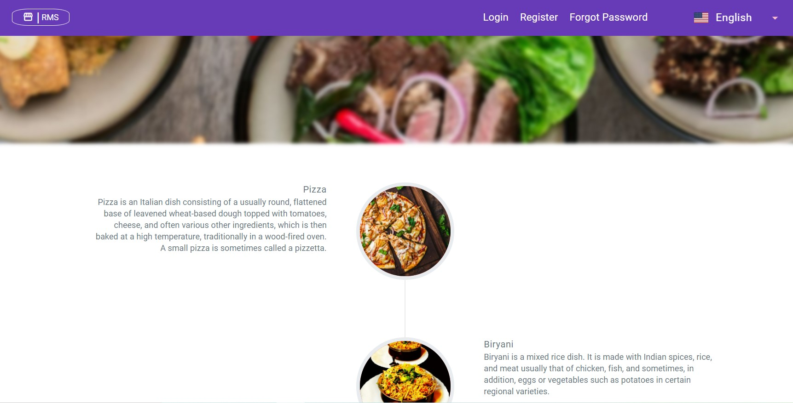
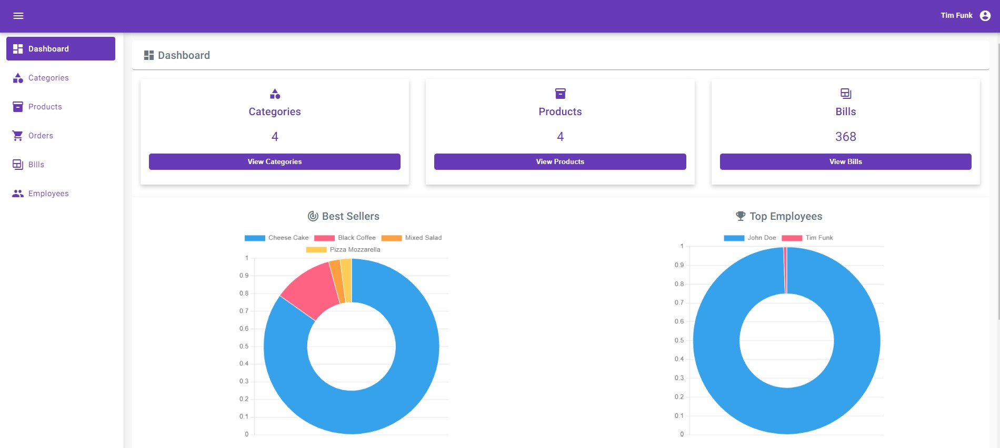
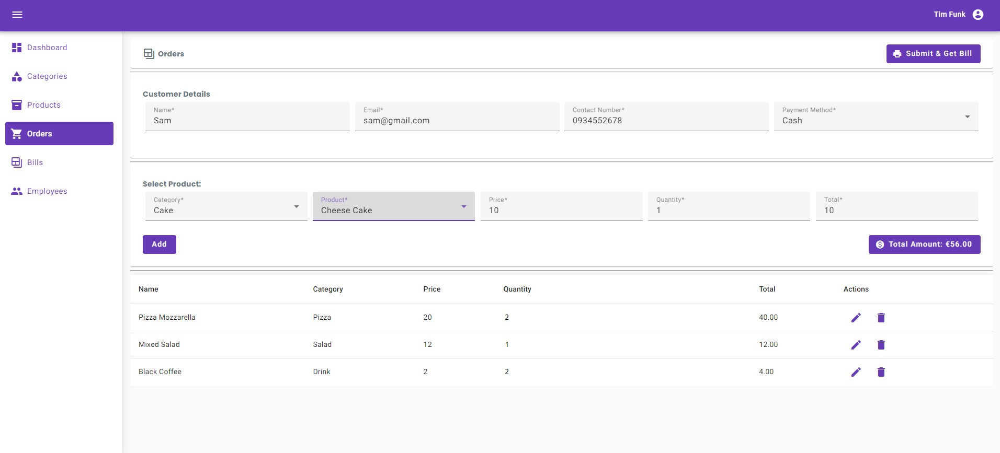
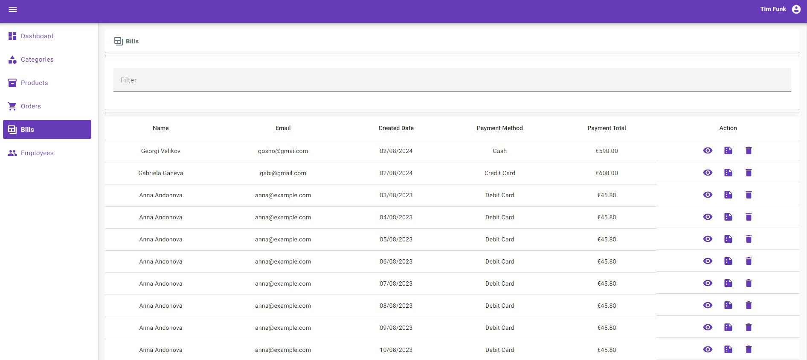
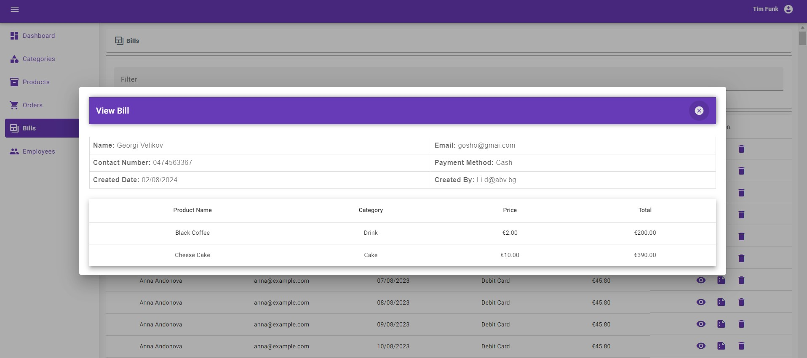
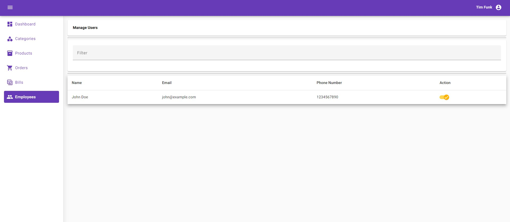
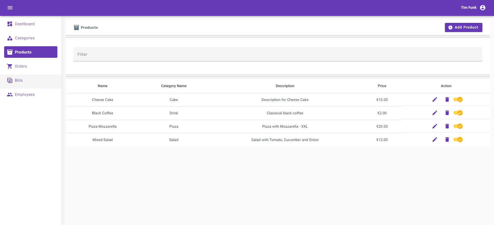
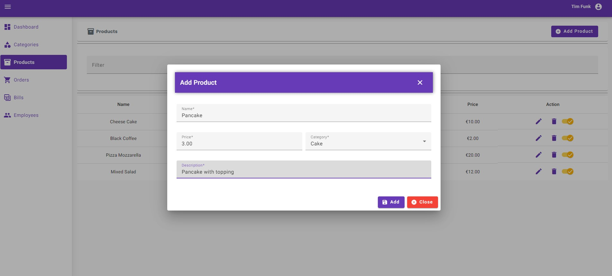

# Restaurant Management System (RMS)

**RMS** is a user-friendly Restaurant Management System designed to help both employees and management efficiently serve guests and organize daily tasks.
The website is built with Spring Boot in the backend and Angular in the frontend.

This is my final project of the [CS50x](https://pll.harvard.edu/course/cs50-introduction-computer-science) course by [Harvard University](https://pll.harvard.edu/) in 2024.

Video Demo: [RMS Video Demo](https://www.youtube.com/watch?v=nQVFAzQCa2w) 

## Table of Contents

1. [Prerequisites](#1-prerequisites)
2. [Project Structure](#2-project-structure)
3. [Technologies](#3-technologies)
4. [Setup](#4-setup)
5. [Features](#5-features)
6. [API Documentation](#6-api-documentation)
7. [Core implementations](#7-core-implementations)
8. [Bonus implementations](#8-bonus-implementations)
9. [Screenshots](#9-screenshots)

## 1. Prerequisites

For building and running the application you need:

- Java Development Kit (JDK) (version 17 or later)
- Node.js (version 14 or later) and npm
- Angular CLI
- Maven
- Git

## 2. Project Structure

The Restaurant Management System (RMS) application is divided into two main parts:
restaurant_backend and restaurant_frontend.

- **restaurant_backend** contains the backend logic and is further divided into two modules:
    - **com.lididimi.restaurant** is the core of the Restaurant Management System, handling all the business logic and interactions.
    - **restaurant_categories** module provides category services which are utilized by the RMS.
- **restaurant_frontend** contains the frontend application, built using Angular, which interacts with the backend to provide a user interface for managing the restaurant.


## 3. Technologies
Some of the key technologies used in the project include:

**Backend:**
- Spring Boot
- Spring MVC
- Spring Data JPA
- Hibernate
- Bcrypt
- JsonWebToken
- Cloudinary
- JUnit 5
- Mockito

**Database:**
- MySQL

**Frontend:**
- Angular
- Rxjs


## 4. Setup

To run RMS application on your local machine you have two main alternatives:  
👉 clone the GitHub repository  
👉 pull the docker images from Docker Hub.

### 4.1. Clone the Repository

#### 1. Backend Setup (Spring Boot)

Step 1: Clone the Repository

1) Open a terminal or command prompt.
2) Clone the repository

```    
git clone https://@github.com:dimilidi/restaurant-management-system.git
  ```
3) Navigate to the backend directory and com.lididimi.restaurant app
```    
cd restaurant_backend/com.lididimi.restaurant
  ```
Step 2: Configure the Backend
1) Open the *src/main/resources/application.yaml* file.
2) Update the database connection settings and any other required configurations.
   Ensure placeholders like ${db_password} are replaced with actual values or set them as environment variables.

Step 3: Build the Backend

1) Ensure Maven is installed. You can verify this by running mvn -v.
2) Compile and package the Spring Boot application using Maven:
``` 
mvn clean install
``` 
To run the Spring Boot application:
``` 
mvn spring-boot:run
``` 
Alternatively, you can start the application by executing the main method of the main application class (*RestaurantManagementSystemApplication*) from your IDE.  
The backend will be running at http://localhost:9090.

Step 4: Navigate to category service
```    
cd restaurant_backend/restaurant_categories
  ```

Step 5: Repeat steps 2 and 3 for category app  
The category service will be running at http://localhost:8081.

#### 2. Frontend Setup (Angular)

Step 1: Navigate to the Frontend Directory

1) Open a new terminal or command prompt.
2) Navigate to the frontend directory:
```    
cd  restaurant_frontend
  ```

Step 2: Install Node.js Dependencies

1) Ensure Node.js and npm are installed. Verify by running node -v and npm -v.
2) Install the required dependencies:
```    
npm install
  ```

Step 3: Serve the Frontend

To start a local development server:
```    
ng serve
  ```
This will start the Angular application on http://localhost:4200.


#### 3. Access the Application
1) Ensure the backend Spring Boot application is running at http://localhost:9090.
2) Ensure the category service application is running at http://localhost:8081.
3) Ensure the Angular development server is running at http://localhost:4200.
4) Open a web browser.
   Navigate to http://localhost:4200 to interact with the Angular frontend.


### 4.2. Docker Setup
You can also run the backend services using Docker images.
The Docker images for the Restaurant and Categories services are available on Docker Hub.

#### 1. Pull Docker Images
You can pull the Docker images from Docker Hub using the following commands:
```
docker pull lidididi/restaurant:v6
docker pull lidididi/categories:v4
```

#### 2. Run Services with Docker Compose

Use Docker Compose to set up and run the database, restaurant, and categories services.
The docker-compose.yml is in the docker folder of the Restaurant Service.  
Create a `.env` file in the same directory as your `docker-compose.yml` file
and add and configure the environment variables listed in the `env.example` file.


#### 3. Start the Services

Run the following command in the directory containing your docker-compose.yml file:

```
 docker-compose -f docker-compose.yaml up
```

#### 4. Verify the Services

Ensure the services are running by executing:

```
 docker-compose ps
```

## 5. Features

**Public part**
- View bestseller products with details
- Sign up, login, password reset
- Page translation
- Use the app in desktop and mobile version

**Private Part**
- View dashboard, categories and products
- Make orders, generate and view own bills
- Filter, sort data in the tables
- Change password

**Admin Part**
- Create, view, edit and delete products and categories
- Have overview of all users and manage their status
- Track, download, delete all bills

## 6. API Documentation

The RMS application includes comprehensive API documentation using Swagger/OpenAPI. This documentation provides details about  endpoints, request parameters, response formats, and possible status codes.

Access the API Documentation
Once the backend services are running, you can access the API documentation at the following URL:
```
http://localhost:9090/swagger-ui.html
```
This will open the Swagger UI interface, where you can explore the API, view detailed information about some endpoints, and use the "Try it out" feature to test the endpoints directly from the browser.

Authorize Requests
For endpoints that require authentication, you need to provide a Bearer token. To do this - click on the "Authorize" button in the Swagger UI.
In the value field, enter your Bearer token in the format.
Click "Authorize" and then "Close".
This will attach the token to all subsequent requests, allowing you to test authenticated endpoints.

## 7. Core implementations
1) Security
- Used standard Spring Security for managing users and roles
2) Validation and Error Handling
- Client-side and server-side validation with appropriate validation messages
- Global server-side exception handling with the @ControllerAdvice
3) Internationalization (i18n)
- Support multiple languages (English, German, French)
4) Scheduling
- Scheduler runs every day at 2 am and deletes bills older than 1 year
5) Mapping
- Used ModelMapper library for object mapping like DTO to Entity and Entity to DTO Conversion
  in ProductServiceImpl, BillServiceImpl, ReportServiceImpl, UserServiceImpl
6) Testing
- Unit & Integration tests with 60% coverage on business logic using JUnit 5 and Mockito


## 8. Bonus implementations
1) Used Angular for the front-end.
2) Hosted the application in a cloud environment - Azure.
3) Used a file storage cloud API - Cloudinary.
4) Used JWT authentication.
5) Implemented a logging feature using Logback:
    - Logs are archived when they reach a certain size.
    - Sends an email notification when a critical error causes the application to fail.
6) Added API Documentation using Swagger and OpenAPI.
7) Created Docker images of the backend services.
8) Implemented AOP monitoring aspect with around advice for method execution time.


## 9. Screenshots











